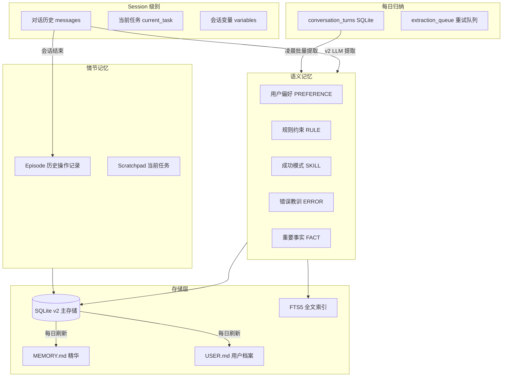
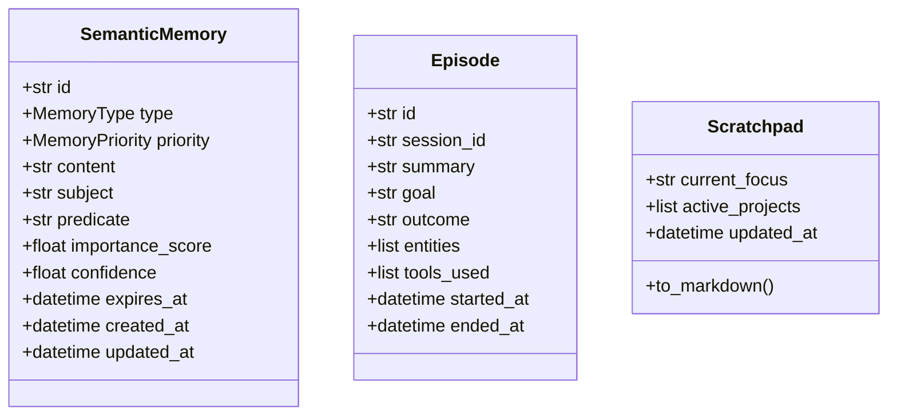
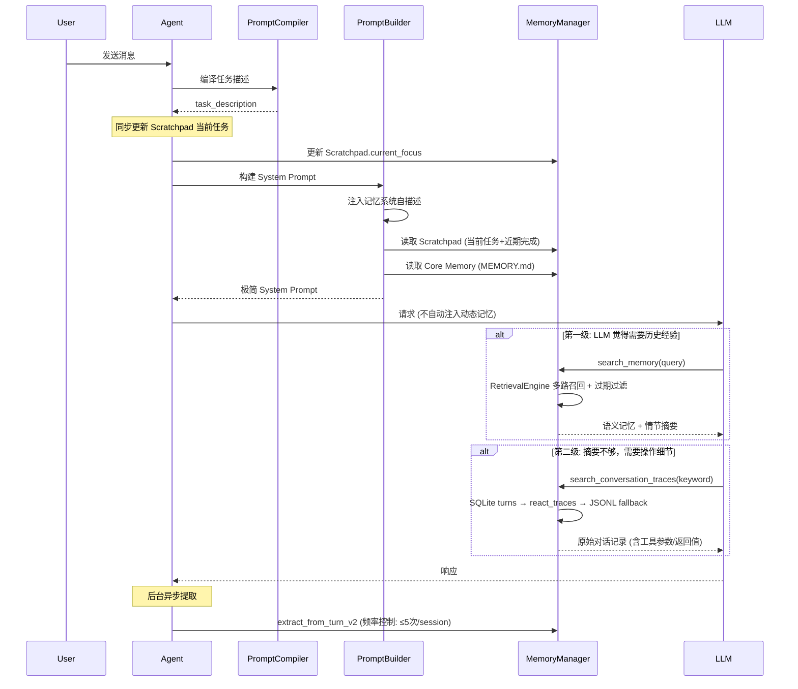
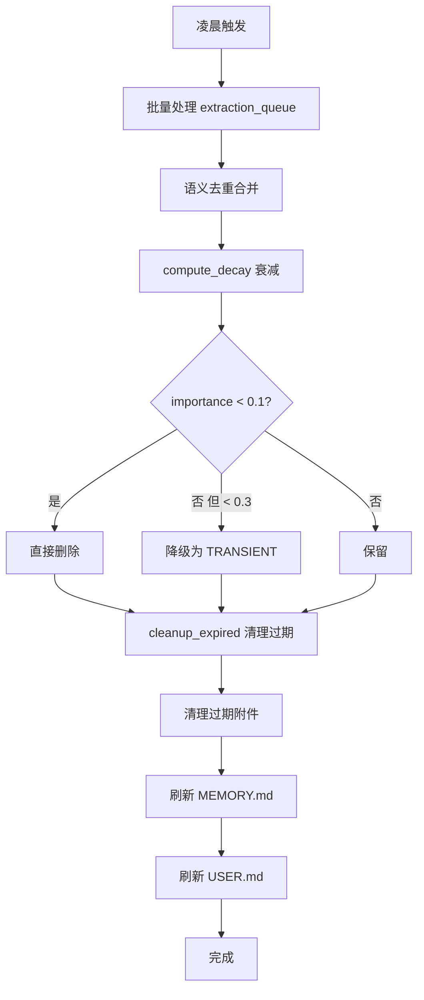

# OpenAkita 完整项目文档

## 目录
1. [项目概述](#项目概述)
2. [系统架构](#系统架构)
3. [核心模块详解](#核心模块详解)
4. [多Agent协作系统](#多agent协作系统)
5. [记忆系统](#记忆系统)
6. [工具系统](#工具系统)
7. [技能系统](#技能系统)
8. [LLM集成](#llm集成)
9. [IM通道](#im通道)
10. [API接口](#api接口)
11. [前端应用](#前端应用)
12. [部署指南](#部署指南)

---

## 项目概述

### 项目简介

**OpenAkita** 是一款开源全能 AI 助手系统，具有以下核心特点：

- **永不放弃**：基于 Ralph Wiggum 模式，任务未完成绝不终止
- **自我进化**：自动学习和进化，动态安装新技能
- **多Agent协作**：多个 AI 专业分工、并行处理、自动接力
- **30+ 大模型支持**：DeepSeek、通义千问、Kimi、Claude、GPT、Gemini 等
- **6 大 IM 平台**：Telegram、飞书、企微、钉钉、QQ、OneBot
- **89+ 内置工具**：上网搜索、操作电脑、读写文件、浏览器自动化等

### 技术栈

| 类别 | 技术选型 |
|------|----------|
| 后端 | Python 3.11+ |
| Web框架 | FastAPI + Uvicorn |
| 桌面应用 | Tauri 2.x + React + TypeScript |
| 移动端 | Capacitor |
| 数据库 | SQLite + FTS5 全文索引 |
| 异步处理 | asyncio |
| 配置管理 | Pydantic + YAML |

### 项目结构

```
/workspace/
├── apps/                     # 应用程序
│   └── setup-center/        # 桌面/移动端应用（Tauri + React）
├── auth_api/                # 认证 API
├── build/                   # 构建脚本
├── channels/                # 通道配置
├── cloud/                   # 云服务相关
├── data/                    # 数据目录
├── docs/                    # 文档
├── docs-site/               # 文档网站
├── examples/                # 示例
├── identity/                # 身份配置
│   ├── personas/            # 人格预设
│   ├── prompts/             # 提示词
│   └── runtime/             # 运行时文件
├── mcps/                    # MCP 服务器
├── openakita-plugin-sdk/    # 插件 SDK
├── plugins/                 # 插件
├── prompts/                 # 提示词
├── research/                # 研究文档
├── scripts/                 # 脚本工具
├── skills/                  # 技能目录
├── specs/                   # 规范文档
├── src/                     # 源代码
│   └── openakita/          # 主包
│       ├── agents/          # 多Agent系统
│       ├── api/             # REST API
│       ├── channels/        # IM通道
│       ├── core/            # 核心模块
│       ├── evaluation/      # 评估
│       ├── evolution/       # 自我进化
│       ├── hub/             # 技能市场
│       ├── integrations/    # 集成
│       ├── llm/             # LLM集成
│       ├── logging/         # 日志
│       ├── memory/          # 记忆系统
│       ├── orgs/            # 组织系统
│       ├── plugins/         # 插件系统
│       ├── prompt/          # 提示词系统
│       ├── scheduler/       # 调度器
│       ├── sessions/        # 会话管理
│       ├── setup/           # 初始化向导
│       ├── setup_center/    # 设置中心
│       ├── skills/          # 技能系统
│       ├── storage/         # 存储
│       ├── testing/         # 测试
│       ├── tools/           # 工具系统
│       ├── tracing/         # 追踪
│       ├── utils/           # 工具函数
│       └── workspace/       # 工作区
├── tests/                   # 测试
└── tools/                   # 工具
```

---

## 系统架构

### 整体架构图

```
┌─────────────────────────────────────────────────────────────┐
│                      用户接口层                                  │
│   ┌─────┐  ┌──────────┐  ┌────────┐  ┌────────┐  ┌─────┐   │
│   │ CLI │  │ Telegram │  │DingTalk│  │ Feishu │  │ ... │   │
│   └──┬──┘  └────┬─────┘  └───┬────┘  └───┬────┘  └──┬──┘   │
│      └──────────┴────────────┴───────────┴──────────┘       │
│                            ↓                                 │
├─────────────────────────────────────────────────────────────┤
│                     Channel Gateway                           │
│              (消息路由 & 规范化)                            │
├─────────────────────────────────────────────────────────────┤
│                       Agent Core                             │
│  ┌──────────────────────────────────────────────────────┐  │
│  │                    Identity Layer                      │  │
│  │  ┌─────────┐  ┌─────────┐  ┌─────────┐  ┌─────────┐ │  │
│  │  │ SOUL.md │  │AGENT.md │  │ USER.md │  │MEMORY.md│ │  │
│  │  └─────────┘  └─────────┘  └─────────┘  └─────────┘ │  │
│  └──────────────────────────────────────────────────────┘  │
│  ┌──────────────────────────────────────────────────────┐  │
│  │                   Processing Layer                     │  │
│  │  ┌────────────────┐  ┌────────────┐                  │  │
│  │  │Prompt Compiler │  │  Session   │                  │  │
│  │  │ (Stage 1)      │  │  Manager   │                  │  │
│  │  └───────┬────────┘  └────────────┘                  │  │
│  │          ↓                                            │  │
│  │  ┌────────────────┐  ┌─────────────────────┐         │  │
│  │  │ Brain (Claude) │  │    Ralph Loop       │         │  │
│  │  │ (Stage 2)      │  │  (Never Give Up)    │         │  │
│  │  └────────────────┘  └─────────────────────┘         │  │
│  └──────────────────────────────────────────────────────┘  │
├─────────────────────────────────────────────────────────────┤
│                       Tool Layer                             │
│  ┌────────┐  ┌────────┐  ┌────────┐  ┌────────┐           │
│  │ Shell  │  │  File  │  │  Web   │  │  MCP   │           │
│  └────────┘  └────────┘  └────────┘  └────────┘           │
├─────────────────────────────────────────────────────────────┤
│                    Evolution Engine                          │
│  ┌──────────┐  ┌───────────┐  ┌────────────────┐          │
│  │ Analyzer │  │ Installer │  │ SkillGenerator │          │
│  └──────────┘  └───────────┘  └────────────────┘          │
├─────────────────────────────────────────────────────────────┤
│                    Storage Layer                             │
│  ┌────────────┐  ┌─────────────┐  ┌───────────────┐       │
│  │   SQLite   │  │   Sessions  │  │    Skills     │       │
│  └────────────┘  └─────────────┘  └───────────────┘       │
└─────────────────────────────────────────────────────────────┘
```

### 核心设计原则

1. **异步优先**：所有 I/O 操作使用 `async/await`
2. **安全执行**：多层安全检查和操作确认
3. **无状态设计**：每个请求无状态，状态持久化到 SQLite
4. **模块化扩展**：技能可动态添加，通道遵循适配器模式

---

## 核心模块详解

### 1. Agent 核心模块

**文件位置**：[src/openakita/core/agent.py](file:///workspace/src/openakita/core/agent.py)

Agent 是 OpenAkita 的主类，负责：
- 接收用户输入
- 协调各个模块
- 执行工具调用
- 执行 Ralph 循环（永不放弃）
- 管理对话和记忆
- 自我进化（技能搜索、安装、生成）

#### 核心属性

| 属性 | 说明 |
|------|------|
| `brain` | LLM 交互层（Brain 实例） |
| `identity` | 身份管理 |
| `memory_manager` | 记忆管理器 |
| `skill_manager` | 技能管理器 |
| `context_manager` | 上下文管理器 |
| `tool_executor` | 工具执行器 |
| `reasoning_engine` | 推理引擎 |

#### 核心方法

```python
async def chat(self, message: str) -> str
    """处理用户消息并返回响应"""

async def chat_with_session(
    self,
    message: str,
    session_messages: list,
    session_id: str,
    session,
    gateway,
) -> str
    """带会话上下文的对话"""

async def chat_with_session_stream(
    self,
    message: str,
    session_messages: list,
    session_id: str,
    session,
    gateway,
) -> AsyncIterator[dict]
    """流式对话，返回 SSE 事件"""

async def initialize(self) -> None
    """初始化 Agent"""

async def self_check(self) -> dict
    """运行自检"""
```

#### 两段式 Prompt 架构

**Stage 1: Prompt Compiler**
- 将用户请求转化为结构化 YAML 任务定义
- 独立上下文，使用后销毁
- 记录日志用于调试，但不显示在对话中

```yaml
task_type: [question/action/creation/analysis/reminder/other]
goal: [一句话描述任务目标]
inputs:
  given: [已提供的信息列表]
  missing: [缺失但可能需要的信息列表]
constraints: [约束条件列表]
output_requirements: [输出要求列表]
risks_or_ambiguities: [风险或歧义点列表]
```

**Stage 2: Main Brain Processing**
- 接收 Stage 1 的结构化任务定义
- 完整工具访问和对话上下文
- 明确理解任务后执行

---

### 2. Brain 模块（LLM 交互层）

**文件位置**：[src/openakita/core/brain.py](file:///workspace/src/openakita/core/brain.py)

Brain 是 LLMClient 的薄包装，提供向后兼容的接口。所有实际的 LLM 调用、能力分流、故障切换都由 LLMClient 处理。

#### 核心功能

| 功能 | 说明 |
|------|------|
| 流式响应 | 支持实时流式输出 |
| 工具调用 | 原生支持 function calling |
| 重试机制 | 指数退避重试 |
| Token 管理 | Token 追踪和预算管理 |
| Thinking 模式 | 深度推理模式（默认启用） |
| 完整交互日志 | 记录系统提示词、消息、工具调用 |

#### 核心类

```python
@dataclass
class Response:
    """LLM 响应（向后兼容）"""
    content: str
    tool_calls: list[dict] = field(default_factory=list)
    stop_reason: str = ""
    usage: dict = field(default_factory=dict)

@dataclass
class Context:
    """对话上下文"""
    messages: list[MessageParam] = field(default_factory=list)
    system: str = ""
    tools: list[ToolParam] = field(default_factory=list)

class Brain:
    """Agent 大脑 - LLM 交互层"""

    def __init__(
        self,
        api_key: str | None = None,
        base_url: str | None = None,
        model: str | None = None,
        max_tokens: int | None = None,
    ):
        """初始化 Brain"""

    async def think(self, messages, tools) -> Response:
        """非流式思考"""

    async def stream_think(self, messages, tools) -> AsyncIterator:
        """流式思考"""
```

---

### 3. ReasoningEngine（推理引擎）

**文件位置**：[src/openakita/core/reasoning_engine.py](file:///workspace/src/openakita/core/reasoning_engine.py)

推理引擎实现了 ReAct（Reasoning-Action）模式，提供显式的 Reason → Act → Observe 三阶段循环。

#### 核心职责

- 显式推理循环管理
- LLM 响应解析与 Decision 分类
- 工具调用编排（委托给 ToolExecutor）
- 上下文压缩触发（委托给 ContextManager）
- 循环检测（签名重复、自检间隔、安全阈值）
- 模型切换逻辑
- 任务完成度验证（委托给 ResponseHandler）

#### 决策类型

```python
class DecisionType(Enum):
    """LLM 决策类型"""
    FINAL_ANSWER = "final_answer"  # 纯文本响应
    TOOL_CALLS = "tool_calls"  # 需要工具调用
```

---

### 4. Ralph Loop（永不放弃循环）

**文件位置**：[src/openakita/core/ralph.py](file:///workspace/src/openakita/core/ralph.py)

Ralph Loop 实现了 "永不放弃" 的哲学：

```
while not task_complete:
    result = execute_step()
    if result.failed:
        analyze_failure()
        if can_fix_locally:
            apply_fix()
        else:
            search_github_for_solution()
            if found:
                install_and_retry()
            else:
                generate_solution()
    verify_progress()
    save_to_memory()
```

---

### 5. ContextManager（上下文管理器）

**文件位置**：[src/openakita/core/context_manager.py](file:///workspace/src/openakita/core/context_manager.py)

负责管理对话上下文，包括：
- 消息历史管理
- 上下文压缩
- Token 预算管理
- 上下文窗口自适应

---

### 6. ToolExecutor（工具执行器）

**文件位置**：[src/openakita/core/tool_executor.py](file:///workspace/src/openakita/core/tool_executor.py)

负责工具调用的安全执行：
- 工具验证
- 权限检查
- 超时控制
- 错误处理
- 结果格式化

---

## 多Agent协作系统

### 系统架构

**文件位置**：[src/openakita/agents/orchestrator.py](file:///workspace/src/openakita/agents/orchestrator.py)

多Agent系统通过 `multi_agent_enabled` 配置项与单Agent模式完全隔离。

```
┌───────────────────────────────────────────────────────────────────┐
│                     MessageGateway                                │
│  • 统一消息路由          • @检测 / 群聊策略                         │
│  • IM 命令拦截            • 优雅关闭 (drain 模式)                   │
│  • /模式 /切换 /help      • 多 Bot 实例管理                        │
└────────────────────────────┬──────────────────────────────────────┘
                             │
              ┌──────────────┴──────────────┐
              │    multi_agent_enabled?      │
              └──────┬──────────────┬────────┘
                     │ False        │ True
                     ▼              ▼
           ┌──────────────┐  ┌──────────────────────┐
           │  单 Agent     │  │  AgentOrchestrator    │
           │  (现有流程)   │  │  ┌──────────────────┐ │
           │              │  │  │ ProfileStore     │ │
           │              │  │  │ AgentFactory     │ │
           │              │  │  │ InstancePool     │ │
           │              │  │  │ FallbackResolver │ │
           │              │  │  │ TaskQueue        │ │
           │              │  │  │ LockManager      │ │
           └──────────────┘  │  └──────────────────┘ │
                     │              └──────────────────────┘
                     ▼              ▼
           ┌──────────────────────────────────────────┐
           │            ReasoningEngine                │
           │  • LLM 调用 + 工具执行 + 流式输出          │
           │  • Token 追踪 (per-agent 维度)            │
           └──────────────────────────────────────────┘
```

### 核心组件

#### 1. AgentProfile（Agent 蓝图）

**文件位置**：[src/openakita/agents/profile.py](file:///workspace/src/openakita/agents/profile.py)

定义 Agent 的身份和能力：

| 字段 | 说明 |
|------|------|
| `id` | 唯一标识，如 `code-assistant` |
| `name` / `name_i18n` | 显示名称（支持多语言） |
| `description` / `description_i18n` | 功能描述 |
| `type` | `SYSTEM` / `CUSTOM` / `DYNAMIC` |
| `skills` | 携带的技能列表 |
| `skills_mode` | `ALL` / `INCLUSIVE` / `EXCLUSIVE` |
| `custom_prompt` | 自定义系统提示词后缀 |
| `icon` / `color` | 前端显示属性 |
| `fallback_profile_id` | 失败时的降级目标 |
| `created_by` | `system` / `user` / `ai` |

#### 2. AgentOrchestrator（中央协调器）

**文件位置**：[src/openakita/agents/orchestrator.py](file:///workspace/src/openakita/agents/orchestrator.py)

替代旧的 ZMQ `MasterAgent`，职责：

- **消息路由**：根据 `session.context.agent_profile_id` 选择 Agent
- **委派管理**：支持 Agent 间委派，深度限制 (`MAX_DELEGATION_DEPTH=5`)
- **超时/失败/取消**：`asyncio.wait_for` 超时，自动 fallback
- **健康监控**：按 profile_id 追踪成功率、延迟、错误
- **SSE 通知**：委派时通过 `handoff_events` 通知前端

**请求流程：**
```
handle_message(session, message)
    ├─ 获取 agent_profile_id
    ├─ _dispatch(session, message, profile_id, depth=0)
    │   ├─ 健康计数 +1
    │   ├─ asyncio.wait_for(_execute_agent(...), timeout)
    │   │   ├─ pool.get_or_create(session_id, profile)
    │   │   └─ agent.chat_with_session(...)
    │   ├─ 成功 → 记录延迟，fallback.record_success
    │   └─ 失败/超时 → fallback 检查 → 递归 _dispatch(depth+1)
    └─ 返回结果
```

#### 3. AgentFactory + AgentInstancePool

**文件位置**：[src/openakita/agents/factory.py](file:///workspace/src/openakita/agents/factory.py)

- **AgentFactory**：从 `AgentProfile` 创建 `Agent` 实例，应用技能过滤和自定义提示词
- **AgentInstancePool**：per-session 实例管理，空闲 30 分钟自动回收，background reaper 线程

#### 4. FallbackResolver（降级策略）

**文件位置**：[src/openakita/agents/fallback.py](file:///workspace/src/openakita/agents/fallback.py)

追踪每个 profile 的健康状态，连续失败超过阈值（默认 3 次）时建议/触发降级到 `fallback_profile_id`。

#### 5. TaskQueue（优先级任务队列）

**文件位置**：[src/openakita/agents/task_queue.py](file:///workspace/src/openakita/agents/task_queue.py)

5 级优先级（URGENT → BACKGROUND），并发限制，支持取消。用于异步任务调度。

#### 6. LockManager（细粒度资源锁）

**文件位置**：[src/openakita/agents/lock_manager.py](file:///workspace/src/openakita/agents/lock_manager.py)

per-resource 异步锁，防止多 Agent 并发访问共享资源（文件、内存、工具）。支持过期清理。

### 系统预置 Agent

| ID | 图标 | 名称 | 技能 |
|----|------|------|------|
| `default` | 🤖 | 通用助手 | ALL |
| `office-doc` | 📄 | 办公文档 | docx, pptx, xlsx, pdf |
| `code-assistant` | 💻 | 代码助手 | shell, file, web_search |
| `browser-agent` | 🌐 | 浏览器代理 | browser |
| `data-analyst` | 📊 | 数据分析 | xlsx, shell, web_search |

### AI 工具（仅多Agent模式）

#### delegate_to_agent

AI 可委派任务给其他 Agent：
```json
{
  "agent_id": "code-assistant",
  "message": "请帮我写一个排序算法",
  "reason": "需要专业代码能力"
}
```

#### create_agent

AI 可动态创建临时 Agent：
```json
{
  "name": "数据清洗专家",
  "description": "专门处理 CSV 数据清洗",
  "skills": ["shell", "file"],
  "custom_prompt": "你是一个数据清洗专家..."
}
```

**安全策略：**
- 每会话最多创建 3 个动态 Agent
- 委派深度最大 5 层
- 动态 Agent 不能再创建 Agent
- 生命周期最长 60 分钟

---

## 记忆系统

### 架构概述

**文件位置**：[docs/memory_architecture.md](file:///workspace/docs/memory_architecture.md)

OpenAkita 的记忆系统采用 v2 架构，具有三层设计：



### 存储设计

| 存储 | 用途 | 技术 | 更新频率 |
|------|------|------|----------|
| **memories 表** | 语义记忆主存储 | SQLite + FTS5 全文索引 | 实时（每轮提取） |
| **episodes 表** | 情节记忆（对话摘要） | SQLite | 会话结束时生成 |
| **scratchpad 表** | 工作记忆（当前任务） | SQLite | 每轮同步更新 |
| **conversation_turns 表** | 对话原文索引 | SQLite | 实时 |
| **extraction_queue 表** | 提取重试队列 | SQLite (UNIQUE去重) | 异步 |
| **MEMORY.md** | 核心记忆精华 | 文件 | 每日归纳 |
| **USER.md** | 用户档案 | 文件 | 每日归纳 |

### 记忆类型

#### 语义记忆 (SemanticMemory)



| 类型 | 说明 | 示例 | 默认保留 |
|------|------|------|----------|
| FACT | 事实信息 | "用户的代码目录在 D:\code" | 由 LLM 判断 |
| PREFERENCE | 用户偏好 | "用户喜欢用 Python" | permanent |
| SKILL | 成功模式 | "用 pytest 测试更可靠" | permanent |
| ERROR | 错误教训 | "直接删除文件会导致数据丢失" | 7d |
| RULE | 规则约束 | "禁止虚报执行结果" | 24h (任务规则) / permanent (行为规则) |

#### 保留时长机制 (expires_at)

| 优先级 | 保留时长 | 实现方式 |
|--------|----------|----------|
| TRANSIENT | 1 天 | `expires_at = now + 1d`，`end_session` 时清理 |
| SHORT_TERM | 3 天 | `expires_at = now + 3d`，`compute_decay` 低分直接删除 |
| LONG_TERM | 30 天 | `expires_at = now + 30d` |
| PERMANENT | 永不删除 | `expires_at = None` |

v2 提取时 LLM 输出 `duration` 字段 (`permanent|7d|24h|session`)，映射为 `expires_at`。

#### 情节记忆 (Episode)

会话结束时由 LLM 生成的交互摘要，包含目标、结果、使用的工具、涉及的实体。在 `to_markdown()` 中以 "历史操作记录" 标签展示。不再自动注入 system prompt，仅在 LLM 调用 `search_memory` 时按实体匹配返回。

#### 工作记忆 (Scratchpad)

由 compiler `task_description` 驱动的结构化任务状态：
- **当前任务**：来自 compiler 输出，每轮同步更新
- **近期完成**：话题切换时自动归档旧任务（带时间戳，最多 5 条）

### 数据流 — 渐进式披露



### 提取与注入策略

#### 提取策略 (写入端)

| 触发时机 | 方式 | 频率控制 |
|----------|------|----------|
| 用户消息 | `extract_from_turn_v2` (LLM) | ≤5 次/session，≥30 字符 |
| 会话结束 | `generate_episode` (LLM) | 每次会话 1 次 |
| 上下文压缩 | 入队 `extraction_queue` | 去重 (UNIQUE) |
| 凌晨归纳 | `process_unextracted_turns` | 批量处理未提取轮次 |

#### 注入策略 (读取端) — 渐进式披露

System Prompt 只注入极简信息：
1. **记忆系统自描述** — 告知 LLM 两级搜索机制和使用时机
2. **Scratchpad** — 当前任务 + 近期完成
3. **Core Memory** — MEMORY.md 用户基本信息 + 永久规则

动态记忆 **不再自动注入**，由 LLM 按需两级搜索：

| 级别 | 工具 | 数据源 | 适合场景 |
|------|------|--------|----------|
| 第一级 | `search_memory` | RetrievalEngine 多路召回 → SQLite FTS5 fallback | 偏好/规则/经验/操作摘要 |
| 第二级 | `search_conversation_traces` | SQLite turns → react_traces → JSONL | 操作细节（工具参数、返回值原文） |

### 每日归纳流程



---

## 工具系统

### 概述

**文件位置**：[src/openakita/tools/](file:///workspace/src/openakita/tools/)

OpenAkita 提供 89+ 内置工具，涵盖 16 大类。

### 工具分类

| 类别 | 工具前缀 | 说明 |
|------|----------|------|
| Agent | `delegate_to_agent`, `create_agent` | 多Agent协作 |
| File System | `run_shell`, `write_file`, `read_file` | 文件系统操作 |
| Browser | `browser_*` | 浏览器自动化 |
| Desktop | `desktop_*` | 桌面自动化 |
| Memory | `add_memory`, `search_memory` | 记忆操作 |
| Skills | `list_skills`, `run_skill_script` | 技能管理 |
| Scheduled | `schedule_task`, `list_scheduled_tasks` | 定时任务 |
| IM Channel | `deliver_artifacts`, `get_chat_history` | IM 通道 |
| Profile | `update_user_profile`, `get_user_profile` | 用户档案 |
| System | `enable_thinking`, `get_session_logs` | 系统工具 |
| MCP | `call_mcp_tool`, `list_mcp_servers` | MCP 协议 |
| Plan | `create_plan_file`, `exit_plan_mode` | 计划模式 |
| Web Search | `web_search`, `news_search` | 网络搜索 |

### 工具定义格式

**文件位置**：[src/openakita/tools/definitions/base.py](file:///workspace/src/openakita/tools/definitions/base.py)

```python
class ToolDefinition(TypedDict, total=False):
    """工具定义（完整格式）"""

    # 必填字段
    name: str  # 工具名称
    description: str  # 简短描述（Level 1）
    input_schema: dict  # 参数 Schema

    # 推荐字段
    detail: str  # 详细说明（Level 2）
    triggers: list[str]  # 触发条件
    prerequisites: list[str | Prerequisite]  # 前置条件
    examples: list[ToolExample]  # 使用示例

    # 可选字段
    category: str  # 工具分类
    warnings: list[str]  # 重要警告
    related_tools: list[RelatedTool]  # 相关工具
    workflow: Workflow  # 工作流定义
```

### 核心工具模块

#### 1. Shell 工具

**文件位置**：[src/openakita/tools/shell.py](file:///workspace/src/openakita/tools/shell.py)

提供系统命令执行能力，包括：
- 安全执行装饰器
- 超时控制
- 命令黑名单
- 路径限制

#### 2. File 工具

**文件位置**：[src/openakita/tools/file.py](file:///workspace/src/openakita/tools/file.py)

提供文件操作能力：
- 读写文件
- 目录列表
- 文件搜索
- 路径白名单

#### 3. Browser 工具

**文件位置**：[src/openakita/tools/browser/](file:///workspace/src/openakita/tools/browser/)

基于 `browser-use` 和 `playwright` 提供浏览器自动化：
- 导航页面
- 点击元素
- 填写表单
- 截图
- 网页抓取

#### 4. MCP 工具

**文件位置**：[src/openakita/tools/mcp.py](file:///workspace/src/openakita/tools/mcp.py)

支持 Model Context Protocol，可连接外部 MCP 服务器。

### 工具执行流程

```
1. Brain decides tool is needed
2. Tool registry validates request
3. Tool executes with safety checks
4. Result returned to Brain
5. Brain continues reasoning
```

---

## 技能系统

### 概述

**文件位置**：[src/openakita/skills/](file:///workspace/src/openakita/skills/)

技能系统使 OpenAkita 能够动态扩展能力：
- 从本地文件加载
- 从 GitHub 下载
- 由 Agent 动态生成

### 技能结构

#### 基本技能模板

```python
# skills/my_skill.py
from openakita.skills.base import BaseSkill, SkillResult

class MySkill(BaseSkill):
    """A custom skill for OpenAkita."""
    
    name = "my_skill"
    description = "Does something useful"
    version = "1.0.0"
    
    # Required dependencies
    dependencies = ["requests>=2.28.0"]
    
    async def execute(self, **kwargs) -> SkillResult:
        """Execute the skill logic."""
        try:
            # Your implementation here
            result = await self.do_something(kwargs.get("input"))
            return SkillResult(success=True, data=result)
        except Exception as e:
            return SkillResult(success=False, error=str(e))
    
    async def do_something(self, input_data):
        # Implementation
        return f"Processed: {input_data}"
```

### 技能目录

**文件位置**：[skills/](file:///workspace/skills/)

OpenAkita 包含 80+ 内置技能，例如：
- `algorithmic-art`：算法艺术生成
- `apify-scraper`：Apify 爬虫
- `baoyu-*`：宝玉系列技能（文章、漫画、封面等）
- `bilibili-watcher`：B站视频处理
- `canvas-design`：画布设计
- `changelog-generator`：变更日志生成
- `chinese-novelist`：中文小说创作
- `chinese-writing`：中文写作辅助
- `code-review`：代码审查
- `content-research-writer`：内容研究与写作
- `datetime-tool`：日期时间工具
- `doc-coauthoring`：文档协作
- `docx`：Word 文档处理
- `douyin-tool`：抖音工具
- `file-manager`：文件管理器
- `frontend-design`：前端设计
- `github-automation`：GitHub 自动化
- `gmail-automation`：Gmail 自动化
- `google-calendar-automation`：Google 日历自动化
- `image-understander`：图像理解
- `image-understanding`：图像理解（新版）
- `internal-comms`：内部沟通
- `knowledge-capture`：知识捕获
- `mcp-builder`：MCP 构建器
- `mcp-installer`：MCP 安装器
- `notebooklm`：NotebookLM
- `obsidian-skills`：Obsidian 技能
- `pdf`：PDF 处理
- `ppt-creator`：PPT 创建
- `pptx`：PowerPoint 处理
- `pretty-mermaid`：Mermaid 图表美化
- `skill-creator`：技能创建器
- `slack-gif-creator`：Slack GIF 创建器
- `smtp-email-sender`：SMTP 邮件发送
- `summarizer`：摘要生成器
- `superpowers-*`：超能力系列（头脑风暴、调试、委派等）
- `theme-factory`：主题工厂
- `todoist-task`：Todoist 任务
- `translate-pdf`：PDF 翻译
- `video-downloader`：视频下载器
- `web-artifacts-builder`：Web 制品构建器
- `webapp-testing`：Web 应用测试
- `wechat-article`：微信文章
- `xiaohongshu-creator`：小红书创作
- `xlsx`：Excel 处理
- `youtube-summarizer`：YouTube 摘要
- `yuque-skills`：语雀技能

### 技能生命周期

```
┌─────────┐     ┌──────────┐     ┌────────┐     ┌─────────┐
│ Discover │ --> │ Install  │ --> │  Load  │ --> │ Execute │
└─────────┘     └──────────┘     └────────┘     └─────────┘
                     │                                │
                     v                                v
              ┌──────────┐                    ┌──────────┐
              │Dependencies│                   │  Result  │
              └──────────┘                    └──────────┘
```

### 技能加载器

**文件位置**：[src/openakita/skills/loader.py](file:///workspace/src/openakita/skills/loader.py)

遵循 Agent Skills 规范 (agentskills.io/specification)，从标准目录结构加载 SKILL.md 定义的技能。

#### 标准技能目录（按优先级排序）

```python
SKILL_DIRECTORIES = [
    # 内置系统技能（随 pip 包分发，优先级最高）
    "__builtin__",
    # 用户工作区（运行时根据当前工作区动态解析）
    "__user_workspace__",
    # 项目级别（开发模式下仍可扫描）
    "skills",
]
```

---

## LLM集成

### 概述

**文件位置**：[src/openakita/llm/](file:///workspace/src/openakita/llm/)

OpenAkita 支持 30+ 大模型服务商，提供统一的调用接口。

### 支持的服务商

| 类别 | 服务商 |
|------|--------|
| **本地** | Ollama · LM Studio |
| **国际** | Anthropic · OpenAI · Google Gemini · xAI (Grok) · Mistral · OpenRouter · NVIDIA NIM · Groq · Together AI · Fireworks · Cohere |
| **中国区** | 阿里云 DashScope · Kimi（月之暗面）· MiniMax · DeepSeek · 硅基流动 · 火山引擎 · 智谱 AI · 百度千帆 · 腾讯混元 · 云雾 API · 美团 LongCat · 心流 iFlow |

### 能力维度

- 文本
- 图片理解
- 视频理解
- 工具调用
- 深度思考
- 音频理解
- PDF 原生输入

### LLMClient（统一客户端）

**文件位置**：[src/openakita/llm/client.py](file:///workspace/src/openakita/llm/client.py)

提供统一的 LLM 调用接口，支持：
- 多端点配置
- 自动故障切换
- 能力分流（根据请求自动选择合适的端点）
- 健康检查
- 动态模型切换（临时/永久）

#### 核心功能

| 功能 | 说明 |
|------|------|
| 多端点支持 | 可配置多个 LLM 端点 |
| 故障切换 | 某个端点失败自动切换到下一个 |
| 能力分流 | 根据请求类型自动选择合适的端点 |
| 健康检查 | 定期检查端点健康状态 |
| 临时切换 | 支持 per-conversation 临时切换 |
| 并发控制 | 全局并发限制，防止并发风暴 |

#### 端点配置

配置文件位置：`data/llm_endpoints.json`

#### 动态切换

```python
@dataclass
class EndpointOverride:
    """端点临时覆盖配置"""
    endpoint_name: str  # 覆盖到的端点名称
    expires_at: datetime  # 过期时间
    created_at: datetime = field(default_factory=datetime.now)
    reason: str = ""  # 切换原因（可选）
```

### Provider（提供商适配器）

**文件位置**：[src/openakita/llm/providers/](file:///workspace/src/openakita/llm/providers/)

| Provider | 说明 |
|----------|------|
| `AnthropicProvider` | Anthropic Claude 原生 API |
| `OpenAIProvider` | OpenAI 兼容 API |
| `OpenAIResponsesProvider` | OpenAI Responses API |

### Registries（端点注册表）

**文件位置**：[src/openakita/llm/registries/](file:///workspace/src/openakita/llm/registries/)

预配置的端点模板，包括：
- `anthropic.py`：Anthropic 模型
- `openai.py`：OpenAI 模型
- `openrouter.py`：OpenRouter
- `dashscope.py`：阿里云通义千问
- `deepseek.py`：DeepSeek
- `kimi.py`：Kimi（月之暗面）
- `minimax.py`：MiniMax
- `siliconflow.py`：硅基流动
- `volcengine.py`：火山引擎
- `zhipu.py`：智谱 AI

---

## IM通道

### 概述

**文件位置**：[src/openakita/channels/](file:///workspace/src/openakita/channels/)

OpenAkita 支持 6 大 IM 平台，可在常用聊天工具中直接使用。

### 支持的平台

| 平台 | 接入方式 | 亮点 |
|------|----------|------|
| **Telegram** | Webhook / Long Polling | 配对验证、Markdown、代理支持 |
| **飞书** | WebSocket / Webhook | 卡片消息、事件订阅 |
| **企业微信** | 智能机器人回调 | 流式回复、主动推送 |
| **钉钉** | Stream WebSocket | 无需公网 IP |
| **QQ 官方** | WebSocket / Webhook | 群聊、单聊、频道 |
| **OneBot** | WebSocket 正向连接 | 兼容 NapCat / Lagrange / go-cqhttp |

### 通道适配器

**文件位置**：[src/openakita/channels/adapters/](file:///workspace/src/openakita/channels/adapters/)

所有适配器继承自 `BaseChannel`：

```python
class BaseChannel(ABC):
    async def receive_message() -> Message
    async def send_response(response: str)
```

#### 适配器列表

| 适配器 | 文件 | 说明 |
|--------|------|------|
| TelegramAdapter | `telegram.py` | Telegram 机器人 |
| FeishuAdapter | `feishu.py` | 飞书机器人 |
| WeWorkBotAdapter | `wework_bot.py` | 企业微信智能机器人 |
| WeWorkWsAdapter | `wework_ws.py` | 企业微信 WebSocket |
| DingTalkAdapter | `dingtalk.py` | 钉钉机器人 |
| OneBotAdapter | `onebot.py` | OneBot 协议 |
| QQBotAdapter | `qq_official.py` | QQ 官方机器人 |
| WeChatAdapter | `wechat.py` | 微信个人号 |

### MessageGateway（消息网关）

**文件位置**：[src/openakita/channels/gateway.py](file:///workspace/src/openakita/channels/gateway.py)

统一消息路由和管理：
- 统一消息路由
- @检测 / 群聊策略
- IM 命令拦截
- 优雅关闭 (drain 模式)
- 多 Bot 实例管理

### 媒体处理

**文件位置**：[src/openakita/channels/media/](file:///workspace/src/openakita/channels/media/)

支持多种媒体类型：
- 📷 **图片理解**：发截图/照片，AI 看得懂
- 🎤 **语音识别**：发语音消息，自动转文字处理
- 📎 **文件交付**：AI 生成的文件直接推送到聊天

### 群聊响应策略

`GroupResponseMode` 支持三种模式：
- `always` — 所有消息都响应
- `mention_only` — 仅被 `@` 时响应
- `smart` — AI 判断是否响应，带 `SmartModeThrottle` 限流

---

## API接口

### 概述

**文件位置**：[src/openakita/api/server.py](file:///workspace/src/openakita/api/server.py)

基于 FastAPI 的 REST API 服务器，默认端口：18900。

### API端点

**文件位置**：[src/openakita/api/routes/](file:///workspace/src/openakita/api/routes/)

| 端点 | 文件 | 说明 |
|------|------|------|
| `/api/chat` | `chat.py` | 聊天接口（SSE 流式） |
| `/api/chat/models` | `chat_models.py` | 模型列表 |
| `/api/health` | `health.py` | 健康检查 |
| `/api/config` | `config.py` | 配置管理 |
| `/api/agents` | `agents.py` | 多Agent管理 |
| `/api/im` | `im.py` | IM通道管理 |
| `/api/skills` | `skills.py` | 技能管理 |
| `/api/memory` | `memory.py` | 记忆管理 |
| `/api/mcp` | `mcp.py` | MCP管理 |
| `/api/scheduler` | `scheduler.py` | 定时任务 |
| `/api/sessions` | `sessions.py` | 会话管理 |
| `/api/token-stats` | `token_stats.py` | Token统计 |
| `/api/upload` | `upload.py` | 文件上传 |
| `/api/files` | `files.py` | 文件管理 |
| `/api/identity` | `identity.py` | 身份管理 |
| `/api/logs` | `logs.py` | 日志查看 |
| `/api/hub` | `hub.py` | 技能市场 |
| `/api/orgs` | `orgs.py` | 组织系统 |
| `/api/plugins` | `plugins.py` | 插件管理 |
| `/api/workspace-io` | `workspace_io.py` | 工作区IO |
| `/api/bug-report` | `bug_report.py` | Bug反馈 |
| `/api/websocket` | `websocket.py` | WebSocket |
| `/api/auth` | `auth.py` | 认证 |

### 认证中间件

**文件位置**：[src/openakita/api/auth.py](file:///workspace/src/openakita/api/auth.py)

支持 Web 访问配置和认证。

### CORS配置

```python
app.add_middleware(
    CORSMiddleware,
    allow_origins=["*"],
    allow_credentials=True,
    allow_methods=["*"],
    allow_headers=["*"],
)
```

---

## 前端应用

### 概述

**文件位置**：[apps/setup-center/](file:///workspace/apps/setup-center/)

基于 Tauri 2.x + React + TypeScript 的跨平台桌面应用，同时支持移动端（基于 Capacitor）。

### 技术栈

| 类别 | 技术选型 |
|------|----------|
| 桌面框架 | Tauri 2.x |
| 移动端框架 | Capacitor |
| UI框架 | React |
| 语言 | TypeScript |
| 样式 | Tailwind CSS |
| 构建工具 | Vite |

### 功能面板

| 面板 | 功能 |
|------|------|
| **Chat** | AI 聊天、流式输出、Thinking 展示、文件拖拽上传、图片灯箱 |
| **Agent Dashboard** | 神经网络可视化仪表盘，多 Agent 状态实时追踪 |
| **Agent Manager** | 多 Agent 创建、管理、技能配置 |
| **IM Channels** | 6 大平台一站式配置 |
| **Skills** | 技能市场搜索、安装、启用/禁用 |
| **MCP** | MCP 服务器管理 |
| **Memory** | 记忆管理 + LLM 审查清理 |
| **Scheduler** | 定时任务管理 |
| **Token Stats** | Token 用量统计 |
| **Config** | LLM 端点、系统设置、高级选项 |
| **Feedback** | Bug 反馈 + 需求建议 |

### 项目结构

```
apps/setup-center/
├── android/              # Android 原生代码
├── ios-icon/             # iOS 图标
├── public/               # 静态资源
├── src/                  # 源代码
│   ├── App.tsx           # 主应用组件
│   ├── AppContext.tsx    # 应用上下文
│   ├── api.ts            # API 客户端
│   ├── boot.css          # 启动样式
│   ├── constants.ts      # 常量
│   ├── env.d.ts          # 环境类型
│   ├── globals.css       # 全局样式
│   ├── icons.tsx         # 图标
│   ├── localFetch.ts     # 本地获取
│   ├── main.tsx          # 入口文件
│   ├── providers.ts      # 提供者
│   ├── styles.css        # 样式
│   ├── theme.ts          # 主题
│   ├── types.ts          # 类型定义
│   └── utils.ts          # 工具函数
├── src-tauri/            # Tauri Rust 代码
│   ├── Cargo.toml        # Rust 依赖
│   ├── build.rs          # 构建脚本
│   └── tauri.conf.json   # Tauri 配置
├── AGENTS.md             # Agent 文档
├── README.md             # 说明
├── capacitor.config.ts   # Capacitor 配置
├── components.json       # 组件配置
├── index.html            # HTML 入口
├── package.json          # 依赖
├── tsconfig.json         # TypeScript 配置
└── vite.config.ts        # Vite 配置
```

---

## 部署指南

### 快速开始

#### 方式一：桌面客户端（推荐）

**全图形化，不用敲命令行**

| 步骤 | 操作 | 耗时 |
|:----:|------|:----:|
| 1 | 下载安装包，双击安装 | 1 分钟 |
| 2 | 跟着引导向导走，填入 API Key | 2 分钟 |
| 3 | 开始对话 | 立刻 |

- 不需要安装 Python、不需要 git clone、不需要改配置文件
- 环境自动隔离，不会弄乱你电脑上已有的软件
- 中国用户自动切换国内镜像
- 模型、IM、技能、定时任务——全部在图形界面配置

**下载**：[GitHub Releases](https://github.com/openakita/openakita/releases) — Windows (.exe) / macOS (.dmg) / Linux (.deb)

#### 方式二：pip 安装

```bash
pip install openakita[all]    # 安装全部可选功能（IM 通道 + 桌面自动化）
openakita init                # 运行配置向导
openakita                     # 启动交互式 CLI
```

#### 方式三：源码安装

```bash
git clone https://github.com/openakita/openakita.git
cd openakita
python -m venv venv && source venv/bin/activate
pip install -e ".[all]"
openakita init
```

### 常用命令

```bash
openakita                          # 交互式聊天
openakita run "帮我写个计算器"       # 执行单个任务
openakita serve                    # 服务模式（接入 IM）
openakita serve --dev              # 开发模式，热加载
openakita daemon start             # 后台守护进程
openakita status                   # 查看运行状态
```

### Docker 部署

**文件位置**：[docker/](file:///workspace/docker/)

```bash
cd docker
docker-compose up -d
```

### 配置文件

主要配置文件位置：

| 文件 | 说明 |
|------|------|
| `data/llm_endpoints.json` | LLM 端点配置 |
| `data/runtime_state.json` | 运行时状态 |
| `identity/SOUL.md` | 核心价值观 |
| `identity/AGENT.md` | 行为规范 |
| `identity/USER.md` | 用户档案 |
| `identity/MEMORY.md` | 核心记忆 |
| `identity/POLICIES.yaml` | 策略配置 |

---

## 测试

### 测试目录结构

```
tests/
├── component/        # 组件测试
├── e2e/             # 端到端测试
├── fixtures/         # 测试夹具
├── integration/      # 集成测试
├── legacy/          # 遗留测试
├── llm/             # LLM 测试
├── orgs/            # 组织系统测试
├── quality/         # 质量测试
└── unit/            # 单元测试
```

### 运行测试

```bash
# 运行所有测试
python -m pytest

# 运行特定测试
python -m pytest tests/unit/test_config.py

# 运行并生成覆盖率报告
python -m pytest --cov=src/openakita
```

---

## 贡献指南

请参考 [CONTRIBUTING.md](file:///workspace/CONTRIBUTING.md) 了解如何贡献代码。

---

## 许可证

Apache License 2.0 — 详见 [LICENSE](file:///workspace/LICENSE)

---

## 联系我们

- 微信公众号：扫码关注
- 个人微信：备注「OpenAkita」拉你进群
- QQ 群：854429727
- Discord：https://discord.gg/vFwxNVNH
- X (Twitter)：https://x.com/openakita
- Email：zacon365@gmail.com

---

## 致谢

- [Anthropic Claude](https://www.anthropic.com/claude) — 核心 LLM 引擎
- [Tauri](https://tauri.app/) — 桌面终端跨平台框架
- [ChineseBQB](https://github.com/zhaoolee/ChineseBQB) — 5700+ 中文表情包
- [browser-use](https://github.com/browser-use/browser-use) — AI 浏览器自动化
- [AGENTS.md](https://agentsmd.io/) / [Agent Skills](https://agentskills.io/) — 开放标准
